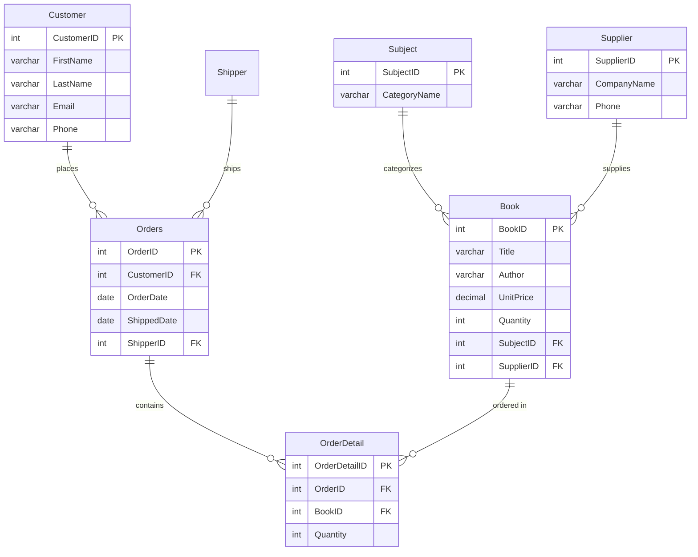

<div align="center">

# 📚 Bookstore Database System

**Full-stack relational database for an online bookstore with PHP web interface and complex SQL queries**

[](https://www.mysql.com)
[](https://www.php.net)
[](https://developer.mozilla.org/en-US/docs/Web/HTML)
[](LICENSE)

</div>

---

## 📋 Overview

A complete **relational database system** for an online bookstore, featuring:
- Normalized database schema with 6 related tables
- PHP/HTML web interface for querying and displaying data
- **19 complex SQL queries** covering JOINs, subqueries, aggregation, and analytics

---

## 🗄️ Database Schema



---

## ✨ SQL Query Highlights

The project includes **19 SQL queries** of increasing complexity:

| # | Query | Concepts Used |
|---|-------|--------------|
| 1 | List all customers | `SELECT *` |
| 5 | Orders per customer | `GROUP BY`, `COUNT` |
| 8 | Books with supplier names | `JOIN` |
| 9 | Unshipped orders | `JOIN`, `WHERE NULL` |
| 10 | Books per category | `LEFT JOIN`, `GROUP BY` |
| 11 | Most expensive book | Subquery with `MAX` |
| 13 | Order totals | Multi-table `JOIN`, `SUM` |
| 17 | Shipments per shipper | `LEFT JOIN`, aggregation |
| 19 | Customer total spending | 4-table `JOIN`, `SUM`, `GROUP BY` |

<details>
<summary>📄 View all 19 queries</summary>

```sql
-- #1: List all customers
SELECT * FROM Customer;

-- #2: Books over $50
SELECT * FROM Book WHERE UnitPrice > 50;

-- #3: Books sorted by price (descending)
SELECT Title, UnitPrice FROM Book ORDER BY UnitPrice DESC;

-- #4: Unique authors
SELECT DISTINCT Author FROM Book;

-- #5: Order count per customer
SELECT CustomerID, COUNT(*) AS OrderCount
FROM Orders GROUP BY CustomerID;

-- #6: Books per supplier
SELECT SupplierID, COUNT(*) AS BookCount
FROM Book GROUP BY SupplierID;

-- #7: Total units sold per book
SELECT BookID, SUM(Quantity) AS TotalSold
FROM OrderDetail GROUP BY BookID;

-- #8: Books with supplier company names
SELECT Book.Title, Supplier.CompanyName
FROM Book JOIN Supplier ON Book.SupplierID = Supplier.SupplierID;

-- #9: Customers with unshipped orders
SELECT Customer.FirstName, Customer.LastName, Orders.OrderDate
FROM Customer JOIN Orders ON Customer.CustomerID = Orders.CustomerID
WHERE Orders.ShippedDate IS NULL;

-- #10: Total books per category
SELECT Subject.CategoryName, COUNT(Book.BookID) AS TotalBooks
FROM Subject LEFT JOIN Book ON Subject.SubjectID = Book.SubjectID
GROUP BY Subject.CategoryName;

-- #11: Most expensive book
SELECT Book.Title, Book.UnitPrice FROM Book
WHERE Book.UnitPrice = (SELECT MAX(UnitPrice) FROM Book);

-- #12: Books ordered by quantity sold
SELECT Book.Title, OrderDetail.Quantity
FROM Book JOIN OrderDetail ON Book.BookID = OrderDetail.BookID
ORDER BY OrderDetail.Quantity DESC;

-- #13: Total revenue per order
SELECT Orders.OrderID, SUM(Book.UnitPrice * OrderDetail.Quantity) AS OrderTotal
FROM Orders JOIN OrderDetail ON Orders.OrderID = OrderDetail.OrderID
JOIN Book ON OrderDetail.BookID = Book.BookID
GROUP BY Orders.OrderID;

-- #14: Average book price per author
SELECT Author, AVG(UnitPrice) AS AvgPrice FROM Book GROUP BY Author;

-- #15: Book titles with supplier phone numbers
SELECT Book.Title, Supplier.Phone
FROM Book JOIN Supplier ON Book.SupplierID = Supplier.SupplierID;

-- #16: Orders in a date range
SELECT OrderID FROM Orders
WHERE OrderDate BETWEEN '2016-08-01' AND '2016-08-04';

-- #17: Shipment count per shipper
SELECT Shipper.ShpperName, COUNT(Orders.OrderID) AS TotalShipped
FROM Shipper LEFT JOIN Orders ON Shipper.ShipperID = Orders.ShipperID
GROUP BY Shipper.ShpperName;

-- #18: Low-stock books
SELECT Book.Title FROM Book WHERE Quantity < 10;

-- #19: Total spending per customer
SELECT Customer.FirstName, Customer.LastName,
       SUM(Book.UnitPrice * OrderDetail.Quantity) AS TotalSpent
FROM Customer
JOIN Orders ON Customer.CustomerID = Orders.CustomerID
JOIN OrderDetail ON Orders.OrderID = OrderDetail.OrderID
JOIN Book ON OrderDetail.BookID = Book.BookID
GROUP BY Customer.CustomerID;
```

</details>

---

## 🚀 Quick Start

### Prerequisites
- [MySQL](https://www.mysql.com/downloads/) 8.0+
- [PHP](https://www.php.net/downloads) 7.4+ (with `mysqli` extension)
- A web server (Apache, Nginx, or PHP built-in server)

### Setup

```bash
# Clone the repository
git clone https://github.com/tonytheg/bookstore-database.git
cd bookstore-database

# Create the database schema
mysql -u root -p < schema.sql

# Configure the database connection (macOS/Linux)
export BOOKSTORE_DB_HOST=127.0.0.1
export BOOKSTORE_DB_PORT=3306
export BOOKSTORE_DB_USER=root
export BOOKSTORE_DB_PASSWORD='your-local-password'
export BOOKSTORE_DB_NAME=OnlineBookstore

# Start the PHP development server
cd src
php -S localhost:8000

# Open http://localhost:8000 in your browser
```

On PowerShell, set the same values before starting PHP:

```powershell
$env:BOOKSTORE_DB_HOST = "127.0.0.1"
$env:BOOKSTORE_DB_PORT = "3306"
$env:BOOKSTORE_DB_USER = "root"
$env:BOOKSTORE_DB_PASSWORD = "your-local-password"
$env:BOOKSTORE_DB_NAME = "OnlineBookstore"
```

Database credentials are read only from the environment and should never be
committed to source control.

---

## 📁 Project Structure

```
bookstore-database/
├── schema.sql        # Database DDL (CREATE TABLE statements)
├── queries.sql       # All 19 SQL queries
├── src/
│   ├── db_config.php # Database connection configuration
│   └── index.php     # Web interface (PHP/HTML)
├── README.md
└── LICENSE
```

---

## 📄 License

This project is licensed under the MIT License — see the [LICENSE](LICENSE) file for details.

---

<div align="center">

**Built with MySQL & PHP**

</div>
